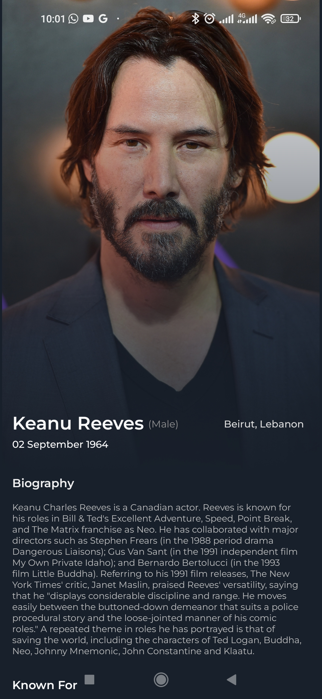

# myMv Movie Apps

An Android application developed in Kotlin leveraging the TMDB API for accessing movie and series data. The app aims to provide a user-friendly interface for browsing movies, TV series, and upcoming releases. Utilizing Firebase Auth for user authentication, the app features onboarding, login, and registration functionalities. It's designed to bolster my skills in mobile development and enhance my portfolio.

## Table of Contents

- [About this Project](#about-this-project)
- [Introduction](#introduction)
- [Features](#features)
- [Libraries Used](#libraries-used)
- [Setup](#setup)
- [Screenshots](#screenshots)
- [License](#license)

## About This Project

This project marks my first foray into Android development using Kotlin. As the sole creator and designer of this app, I took a hands-on approach to not only develop the functionality but also design the UI/UX elements. The design and layout of the app were crafted to enhance user experience and provide an intuitive interface.

Your feedback, suggestions, and contributions to the code or design are not only welcomed but highly appreciated. This project is a testament to my efforts in both development and UI/UX design, marking a significant step in my journey to enhance my skills in mobile app development.

## Introduction

This Android application utilizes the TMDB API to fetch movie and series data. The project is developed using Kotlin and XML for the UI. It incorporates Firebase Auth for user authentication, Glide for image loading, Retrofit for network requests, and Coroutines for asynchronous programming.

## Features

1. **Onboarding:** Introduction screens for new users.
2. **Authentication:** Login and registration functionalities using Firebase Auth.
3. **Homepage:** The homepage presents a list of movies obtained from the TMDB API. The user also can see the movie depending on the genre from list genre. It includes a search bar that allows users to explore the database based on specific queries like movie title
4. **Details Movie:** Provides detailed information about a selected movie, including synopsis, ratings, and cast details.
5. **Details Actor:** Offers in-depth information about specific actors, including their bio, filmography, and other relevant details.
6. **Series Page:** Similar layout to the homepage but displays TV series data.
7. **Upcoming Page:** Displays upcoming movies fetched from the API.
8. **Profile:** User profile information and settings.

## Libraries Used

- [Glide](https://github.com/bumptech/glide): For efficient image loading.
- [Retrofit](https://github.com/square/retrofit): For handling API requests.
- [Kotlin Coroutines](https://github.com/Kotlin/kotlinx.coroutines): For asynchronous programming.
- [Firebase Authentication](https://firebase.google.com/docs/auth): For user authentication.

## Project Structure

Explain the project structure here, e.g., how packages, activities, fragments, or other components are organized.

## Setup

To run this project locally, follow these steps:

1. Clone the repository.
2. Open the project using Android Studio.
3. Build and run the application on an emulator or a connected device.

## Screenshots

Here are some visual representations of the app:

## License

This project is the intellectual property of the creator and owner Fattah Anggit Al Dzakwan. All rights are reserved. It is intended for personal use and may not be distributed, modified, or used for any purpose without explicit permission from the owner.

Please note that the usage of TMDB API is subject to their terms and conditions. For information about using the TMDB API, refer to their official documentation.

For any questions or inquiries regarding the project or its use, please contact fadza20@gmail.com .

